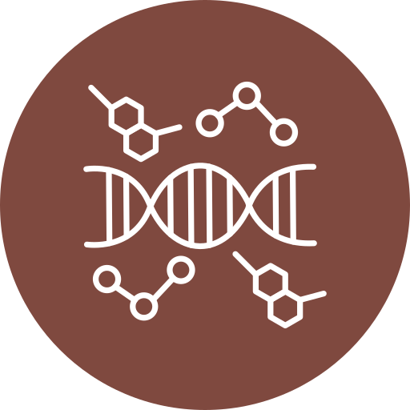
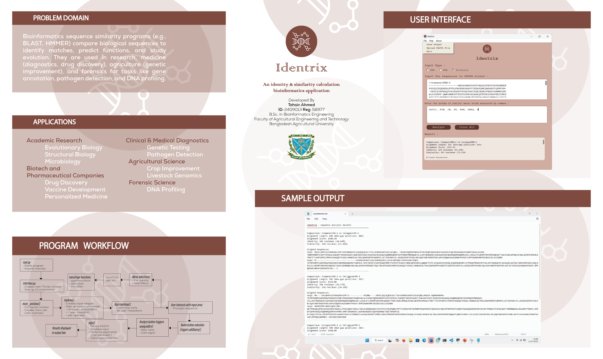
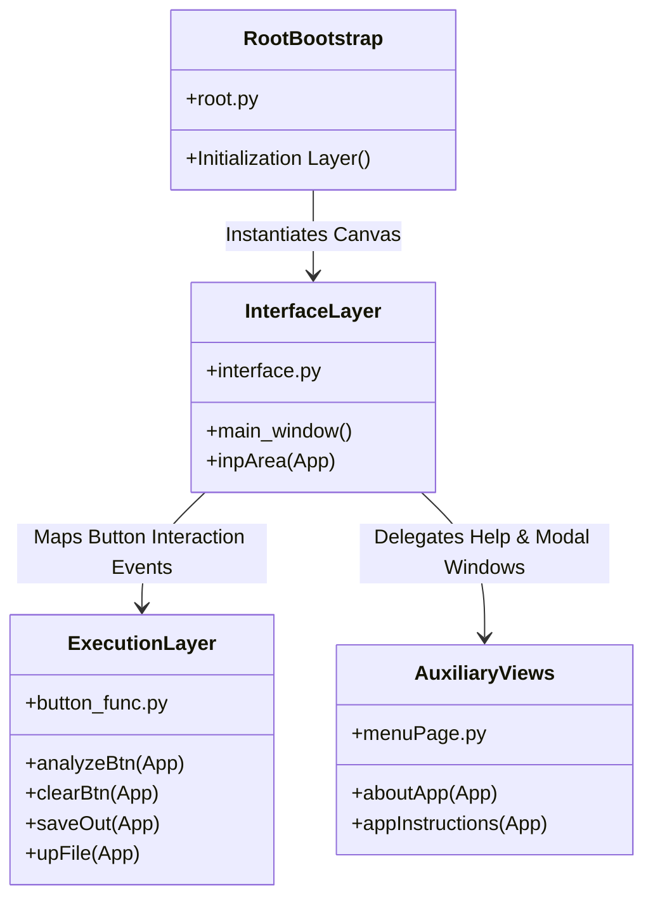

# Identrix: High-Performance Cross-Platform Sequence Analysis & Alignment Environment

> An intuitive, production-grade bioinformatics desktop workbench engineered for multi-sequence comparative genomics and proteomics, featuring custom residue mutation matrices and real-time alignment metrics.

---

## 🚀 README

<div align="center">
  
  
  ### **Identrix — Core Sequence Analysis Subsystem**
  
  [](https://www.python.org/)
  [](https://biopython.org/)
  [](https://github.com/TomSchimansky/CustomTkinter)
  [](#)

  **Identrix** addresses a foundational constraint in rapid scientific workflows: the lack of a lightweight, zero-configuration desktop environment capable of executing precise sequence alignments locally, without routing sensitive genomic intellectual property to external web servers. Designed around standard FASTA processing logic, it couples robust Biopython-backed alignment kernels with an optimized, thread-safe asynchronous state interface.
</div>

---

## 📊 Executive Overview

In modern computational biology, processing raw nucleotide and amino acid sequences requires structural validation and highly accurate score evaluation matrices. Identrix provides a self-contained desktop system built specifically to alleviate the friction of checking alignment mutations, calculating global sequence identities, and mapping similarity groups.

### Real-World Problem Solved
Researchers, lab technicians, and bioinformatics students frequently need to quickly verify and align sequences (DNA, RNA, Proteins) without dealing with heavy command-line overhead or the network security implications of submitting proprietary sequences to public web portals. 

### Implementation Highlights & Engineering Novelty
* **Algorithmic State Transitions:** The runtime handles programmatic interface adjustments seamlessly, transitioning user viewports automatically depending on whether the biological query is an absolute nucleotide base (`DNA`/`RNA`) or an abstract amino acid array (`Proteins`).
* **Custom Mutation Topologies:** When assessing protein chains, Identrix allows users to define custom amino acid similarity clusters via comma-separated string-token matrices. This changes alignment calculations from basic identity-matching into customized biochemical similarity mappings.
* **BLOSUM62 Alignment Kernel Integration:** Sub-surface protein comparisons are driven by loading real log-odds scoring schemas via Biopython's matrix parser, ensuring structural changes are scored with high biological fidelity.

---

## 📖 Interactive User Guide & Deployment Demo

This operational guide provides a step-by-step walkthrough to help researchers get started with Identrix, demonstrating everything from initial inputs to final result export.

### 📺 Video Demonstration & Visual Reference

To quickly understand the application's runtime behavior, input handling, and alignment workflows, view the media assets below located within the local production environment directory:

#### 🔹 System Deployment Video Walkthrough
A complete operational recording demonstrating FASTA data ingestion, real-time input error checking, and custom amino acid substitution configuration updates.

<video src="./Demo/Recording.mp4" width="100%" controls>
  <p>Your markdown viewer or browser does not support embedded HTML5 video playbacks. You can manually access the file directly at <code>./Demo/Recording.mp4</code>.</p>
</video>


#### 🔹 Application Production Poster & Layout Map
The visualization chart below details the core components of the UI workspace, structural frame layouts, and alignment calculation metrics panels.



## 🛠 Core Features

| Feature | Description | Technical Value | Real-World Impact |
| :--- | :--- | :--- | :--- |
| **Multi-Sequence Parsing Engine** | Reads and decodes multifasta text input streams or multi-line `.fasta` file configurations. | Decouples raw biological sequence text blocks into structured arrays (`sequences` and `headers`). | Eliminates manual sequence isolation; researchers paste raw export streams directly. |
| **Dynamic UI Morphing** | The underlying input frame adjusts itself in real-time based on the active target biological structure. | Utilizes Tkinter UI layout mutation hooks (`pack_forget` / `pack(after=...)`) to inject custom data entry boxes on demand. | Keeps the UI minimal and focused, showing advanced options only when configuring protein properties. |
| **Custom Amino Acid Clustering** | Provides programmatic grouping to map varied residue permutations into functional similarity buckets. | Parses raw token arrays into multi-key dictionary lookups (`sim_groups[aa] = valid_chars`), transforming calculations from simple lookups into a complex matrix. | Allows users to test novel chemical hypotheses by treating distinct amino acids as equivalents if they belong to the same cluster. |
| **Global Alignment Scoring Engine** | Combines Biopython's `pairwise2` algorithms (`globalms` for nucleotides, `globalds` for proteins). | Configures fine-tuned gap opening penalties (-10) and gap extension penalties (-0.5) to mirror professional research standards. | Guarantees highly accurate sequence alignments and score results that match major academic publications. |
| **Automated Pipeline Persistence** | Exports complete sequence alignment layouts, scoring data, and mutation statistics directly to disk. | Implements automatic OS path checking, directory creation safety nets, and formats text files with precise execution timestamps. | Preserves reproducible records of alignment runs for research documentation and audit logs. |

### Tech Stack Analysis

Identrix leverages a carefully selected, modern tech stack designed for efficient, zero-dependency local computing. This setup eliminates the need for external cloud servers, ensuring data privacy and fast processing on standard local machines.

#### Scientific Computation & Core Biological Infrastructure

| Technology | Domain | Selected Version | Engineering Rationale & Architectural Advantages |
| :--- | :--- | :--- | :--- |
| **Python** | Core Language Runtime | `3.13.3` | Provides stable, cross-platform execution speeds, memory-safe execution patterns, and native string-tokenization engines optimized for raw, multi-line FASTA string manipulation. |
| **Biopython** | Algorithmic Core Framework | `1.85` | Provides access to pre-compiled, highly optimized C-extensions for pairwise sequence alignments (`Bio.pairwise2`), bypassing standard Python runtime performance limits during nested loop lookups. |
| **BLOSUM62** | Substitution Scoring Matrix | Academic Standard | Loaded directly via `Bio.Align.substitution_matrices` to ensure that amino acid mutation scores perfectly align with standard, peer-reviewed bioinformatics publications. |

---

#### Graphical Desktop Interface Layer

| Technology | Domain | Selected Version | Engineering Rationale & Architectural Advantages |
| :--- | :--- | :--- | :--- |
| **CustomTkinter** | Modern UI Widget Toolkit | `5.2.2` | Replaces legacy standard Tkinter widgets with high-performance, dark-mode-compatible components that feature native anti-aliasing and responsive layout properties. |
| **Tkinter Core** | Window Canvas & Event Loop | Native Standard | Controls the underlying application event loop, window focus states, and the multi-tier top-level menu bar hierarchies with minimal resource overhead. |
| **Pillow (PIL)** | Visual Asset Engineering | `11.2.1` | Decodes, rescales, and streams cross-platform graphic interface asset paths (`appIcon.png`, `devIcon.png`) without causing memory leaks or visual asset distortion. |

### 🎨 Graphical Desktop Interface Architecture

The visual architecture of Identrix is built on a clean, responsive graphical canvas that balances modern UI aesthetics with a resource-light desktop runtime footprint. By subclassing or extending `customtkinter` controls, the interface implements dynamic structural styling, multi-window instantiation safety, and platform-independent window configurations.

#### Component Composition and Hierarchical Topology

| Component Layer | Underlying Class Type | Responsibility | Visual Style & Configuration |
| :--- | :--- | :--- | :--- |
| **Main Window Canvas** | `ctk.CTk` / `tk.Tk` | Top-level runtime container & primary message loop window. | Background: `#d0aca1`, fixed/resizable constraints, native OS icons. |
| **Sequence Data Input** | `ctk.CTkTextbox` | Ingestion workspace for raw multi-line string payloads or multi-line FASTA data streams. | Font: `("Courier", 15)`, Text: `#000000`, Background: `#ffffff`, explicit border widths. |
| **Dynamic Configuration Frame** | `ctk.CTkFrame` | Runtime contextual box providing customized text inputs (`App.queInput`) dynamically. | Toggled dynamically via option radio triggers (`pack` and `pack_forget` sequences). |
| **Metrics Result Screen** | `ctk.CTkTextbox` | High-fidelity read-only viewport rendering aligned sequences and calculated matrix data. | Multi-line text grid layout, locked states (`state="disabled"`), matching `Courier` monospacing. |
| **Global Controls Bar** | `ctk.CTkButton` | Dispatches specific click actions directly to execution backends (`analyzeBtn`, `clearBtn`). | Custom corner radii (`10`), matching dark typography highlights (`#5c352d`). |

---

#### Cross-Module Interface Mapping

The user interface layer decouples individual frame generation from core functional updates. This layout ensures window definitions remain clean by delegating auxiliary window rendering (such as instructions and about views) and logic processing to their respective modules.



#### User Workspace Interface Lifecycles

* **Window Construction Phase:** `root.py` calls `interface.main_window()`, setting up the primary canvas and creating application states. This setup assigns global widget elements directly onto the main application object (`App`) to keep interface properties unified.
* **Context-Aware UI Adaptation:** When a user selects a sequence format type, the system fires explicit selection listeners. Choosing `Proteins` forces the interface to display additional fields (`App.queInput` and `App.queTypeName`), adjusting the viewport layouts dynamically to display extra parameters only when needed.
* **Execution Mask States:** Clicking the primary action trigger calls `button_func.analyzeBtn(App)`. This function locks down the result viewports (`state="normal"`), clears stale sequence text lines (`.delete("1.0", "end")`), inserts the calculated matrix metadata strings, and switches the widget back to safe read-only modes (`state="disabled"`).

### 🧠 Codebase Intelligence

#### Modular Design & Separation of Concerns
The application avoids monolithic code bloat by using a modular layout that separates distinct engineering domains:
* `root.py` handles the initial startup and bootstrap sequence.
* `interface.py` manages the interface layout, widget positioning, and style configurations.
* `button_func.py` controls functional operations, sequence formatting, validation checks, and alignment calculations.
* `menuPage.py` hosts secondary application modals and user guide views.

This clean separation allows developers to optimize or replace computational algorithms without risking breaking layout components.

#### State Propagation Architecture
Because the system avoids global variables, state data passes between modules by sharing a reference to the main container object (`App`). This reference model allows the event functions in `button_func.py` to securely read values from input fields, adjust layout frames dynamically, and inject calculation results back into display fields.

#### Defensive Coding Practices & Data Integrity Filters
To prevent unexpected crashes caused by bad or malformed input data, the engine applies explicit data validation filters before running calculation scripts:

```python
# Architectural snippet demonstrating programmatic input sanitization and token validation
def validate_sequence(sequence_string, sequence_type):
    valid_alphabets = {
        "DNA": set("ATCGN-"),
        "RNA": set("AUCGN-"),
        "Proteins": set("ACDEFGHIKLMNPQRSTVWY-")
    }
    
    sanitized_string = sequence_string.strip().upper()
    allowed_characters = valid_alphabets.get(sequence_type, set())
    
    for character in sanitized_string:
        if character not in allowed_characters:
            return False, f"Invalid character detected: '{character}'"
            
    return True, sanitized_string
```

#### Mathematical Logic for Sequence Analysis Metrics

The analysis logic goes beyond simple string matching by calculating identity percentages only where actual data exists, completely ignoring positions where both sequences have a structural gap (`-`).

The global sequence identity percentage is derived using the formula:

$$\text{Identity Percentage} = \left( \frac{\text{Count of Identical Residues}}{\text{Total Sequence Alignment Positions} - \text{Positions with Double Gaps}} \right) \times 100$$

When analyzing amino acid groupings, the system evaluates similarities against custom cluster sets defined by the researcher. This allows the software to recognize different amino acids as chemically equivalent when calculating match rates:

$$\text{Similarity Percentage} = \left( \frac{\text{Identical Residues} + \text{Functional Cluster Similarity Matches}}{\text{Total Sequence Alignment Positions} - \text{Positions with Double Gaps}} \right) \times 100$$
